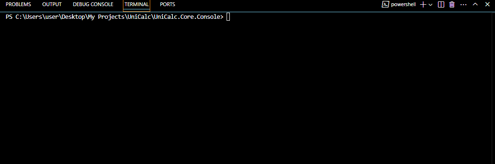
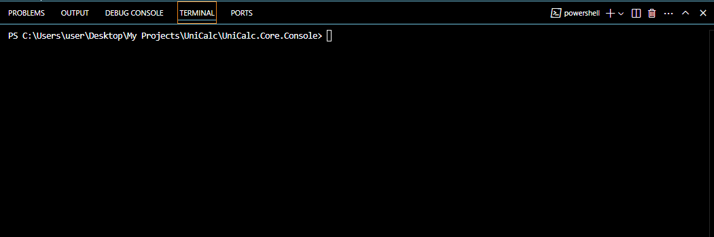

# UniCalc
> UniCalc - bu kalkulyator, valyuta konvertori va yosh hisoblagich xususiyatlarni o'z ichiga olgan konsol dasturi.

## Dasturimiz 4 ta bo'limdan iborat bular: Kalkulyator, valyuta ayirboshlash, yosh hisoblagich, geometriya hisob-kitoblari.

### 1 - Dasturimiz nomi: Kalkulyaltor

> Bu bo'limda siz sonlarni qo'shish, ayirish, ko'paytirish va bo'lish amallarni bajarishingiz mumkin.

#### 1 - bo'lib siz ko'rinshingiz mumkin kalkulyator bo'limida qo'shish amali bajarildi!

#### 2 - bo'lib siz ko'rinshingiz mumkin kalkulyator bo'limida ayirish amali bajarildi

#### 3 - bo'lib siz ko'rishingiz mumkin kalkulyator bo'limida ko'paytirish amali bajarildi

#### 4 - bo'lib siz ko'rishingiz mumkin kalkulyator bo'limida bo'lish amali bajarildi

### Shunday qilib birinchi bo'lim ya'ni kalkulyator bo'limi tushuntirib berdim

